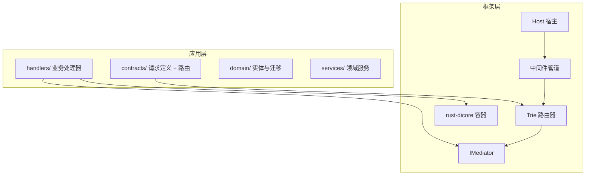

# 什么是 rust-webapp

## 一句话定义

**rust-webapp** 是一个受 ASP.NET Core 启发的 Rust WebApi 框架，以 **DI（依赖注入）+ Mediator（中介者）** 为双核心，通过 **「请求即端点」** 模式，让开发者用类型安全的 Rust 代码定义完整的 HTTP API，而无需手动拼装路由表与处理器映射。

## 解决的核心痛点

在传统 Rust Web 开发中，常见路径是：

```
选择路由库 → 手写路由表 → 自行设计 DI → 拼装中间件 → 统一错误处理 → 重复劳动
```

每一步都需要架构决策，团队难以形成统一规范。rust-webapp 将这些**横切关注点内聚到框架层**：

| 痛点 | rust-webapp 的解法 |
|------|-------------------|
| 路由与处理器脱节 | `IRequest<T>` 自带路由元数据，`#[get("/path")]` 编译时注册 |
| Handler 注册样板代码 | `#[handler]` 宏自动向 DI 容器注册 |
| 模块间强耦合 | `IMediator::send()` 调度请求，`publish()` 发布事件 |
| 错误与 HTTP 状态码映射分散 | 统一 `Error` 类型 + 内置异常中间件 |
| 认证授权各自为政 | `use_auth()` + `#[authorize]` 声明式授权 |

## 产品形态：框架为你提供的应用骨架

使用 rust-webapp 构建的应用，天然具备以下**产品级形态**：



一个典型的 `main.rs` 只有十几行：

```rust
use rust_webapp::*;

#[tokio::main]
async fn main() {
    Host::builder()
        .mode(AppMode::Development)
        .register(|svc| {
            // 注册你的服务与依赖
        })
        .use_spa("wwwroot")      // 可选：SPA 静态托管
        .use_auth()              // 可选：JWT 认证
        .use_memory_cache()      // 可选：分布式缓存
        .build()
        .run()
        .await
        .expect("Server failed");
}
```

其余一切——路由收集、Handler 解析、中间件编排、优雅关闭——由框架在 `build()` 时自动完成。

## 核心能力一览

### 1. 编译时路由与 Handler 注册

```rust
struct HelloRequest;

#[get("/hello")]
impl IRequest<String> for HelloRequest {}

#[derive(Default)]
struct HelloHandler;

#[handler]  // 编译时自动注册到 DI
#[async_trait]
impl IRequestHandler<HelloRequest, String> for HelloHandler {
    async fn handle(&self, _req: HelloRequest) -> Result<String> {
        Ok("Hello, World!".to_string())
    }
}
```

无需在 `main()` 中手写 `router.add("GET", "/hello", ...)`。

### 2. 中介者模式

Handler 不直接调用彼此，而是通过 `IMediator` 调度。这带来：

- **单一职责**：每个 Handler 只处理一种请求
- **可测试性**：Mock Mediator 即可隔离测试
- **横切逻辑**：`IPipelineBehavior` 可在 Handler 前后插入验证、日志、缓存

### 3. 生产级开箱能力

- JWT Bearer 认证 + 基于路由模式的资源授权
- CORS、速率限制、安全响应头、Gzip 压缩
- OpenAPI 3.0 自动生成 + Swagger UI
- SPA 静态文件托管（History 模式 fallback）
- `appsettings.json` 配置体系
- `IHostedService` 后台服务生命周期（数据迁移、种子数据）
- 健康检查、TLS、优雅关闭

## 框架边界：它不是什么

明确边界能避免误用：

- **不是** 全栈 UI 框架——前端任意技术栈，框架提供 API + 可选 SPA 托管
- **不是** ORM——数据库访问由你选型（Docbit 使用 rust-ef 作为示例）
- **不是** 微服务治理平台——不提供服务发现、熔断等（可自行集成）
- **不适合** 极简脚本、单文件 CLI、无 HTTP 需求的系统编程

## 与生态中其他方案的定位

| 方案 | 定位 | rust-webapp 的差异 |
|------|------|-------------------|
| Axum / Actix | 轻量路由 + 自由组合 | rust-webapp 提供完整应用骨架与约定 |
| Rocket | 宏驱动路由 | rust-webapp 强调 DI + Mediator 工程化 |
| ASP.NET Core | 企业级 .NET Web 框架 | rust-webapp 是其 Rust 精神续作 |

## 小结

rust-webapp 的产品形态是：**一个约定优于配置、类型安全、模块边界清晰的 WebApi 应用平台**。你专注于 `contracts` + `handlers` 的业务逻辑，框架负责 HTTP 管道、DI 解析、路由匹配与横切能力。

下一节：[适用场景与边界](who-should-use.md)
