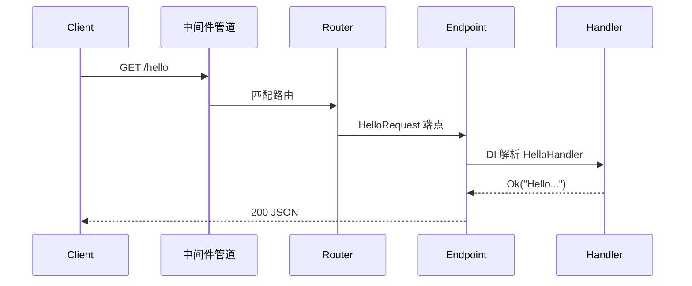

# Hello World 详解

## 完整代码

`src/main.rs`：

```rust
use rust_webapp::*;

// ── 第一步：定义 Request ──
struct HelloRequest;

// ── 第二步：标注路由 ──
#[get("/hello")]
impl IRequest<String> for HelloRequest {}

// ── 第三步：实现 Handler ──
#[derive(Default)]
struct HelloHandler;

#[handler]
#[async_trait]
impl IRequestHandler<HelloRequest, String> for HelloHandler {
    async fn handle(&self, _req: HelloRequest) -> Result<String> {
        Ok("Hello, World! Welcome to rust-webapp.".to_string())
    }
}

// ── 第四步：启动 Host ──
#[tokio::main]
async fn main() {
    Host::builder()
        .build()
        .run()
        .await
        .expect("Server failed");
}
```

运行后访问 `http://localhost:5000/hello`，得到 JSON 字符串响应。

## 四步模式深度解读

### 第一步：定义 Request

```rust
struct HelloRequest;
```

`HelloRequest` 是**零大小类型（ZST）**，承载「这是一个获取问候语的请求」的语义。无路径参数、无 Body 时，struct 可以为空。

Request 结构体的字段将在有参数时发挥作用（路径参数、Query、Body）。

### 第二步：标注路由

```rust
#[get("/hello")]
impl IRequest<String> for HelloRequest {}
```

三个关键信息在这一行确定：

| 元素 | 含义 |
|------|------|
| `#[get("/hello")]` | HTTP GET，路径 `/hello` |
| `impl IRequest<String>` | 响应类型为 `String`，框架序列化为 JSON |
| 标注在 `impl` 块上 | **必须**标注在 impl 块，而非 struct（常见错误） |

编译时，`inventory` 收集此路由元数据；`Host::build()` 时自动注册到 Router。

### 第三步：实现 Handler

```rust
#[derive(Default)]
struct HelloHandler;

#[handler]
#[async_trait]
impl IRequestHandler<HelloRequest, String> for HelloHandler {
    async fn handle(&self, _req: HelloRequest) -> Result<String> { ... }
}
```

| 元素 | 含义 |
|------|------|
| `IRequestHandler<HelloRequest, String>` | 处理 `HelloRequest`，返回 `String` |
| `#[derive(Default)]` | `#[handler]` 宏要求 Handler 可默认构造 |
| `#[handler]` | 编译时向 DI 注册 `dyn IRequestHandler<HelloRequest, String>` |
| `Result<String>` | 成功返回数据，失败返回 `Error`（自动映射 HTTP 状态码） |

### 第四步：启动 Host

```rust
Host::builder().build().run().await
```

`build()` 执行的关键工作：

1. 加载 `appsettings.json`
2. 扫描 `inventory` 收集的所有路由
3. 扫描 `#[handler]` 注册的 Handler
4. 构建 DI 容器与中间件管道
5. 创建 Trie 路由器

`run()` 启动 HTTP 监听器（地址来自 `App.Urls` 配置）。

## 背后发生了什么



你写的代码只涉及 Request + Handler；路由匹配、DI 解析、JSON 序列化均由框架完成。

## 常见变体

### 返回 204 No Content

```rust
#[delete("/items/{id}")]
impl IRequest<()> for DeleteItemRequest {}

impl IRequestHandler<DeleteItemRequest, ()> for DeleteItemHandler {
    async fn handle(&self, req: DeleteItemRequest) -> Result<()> {
        // 删除逻辑
        Ok(())
    }
}
```

`IRequest<()>` 表示响应体为空，HTTP 状态码 204。

### 返回自定义 DTO

```rust
#[derive(Serialize)]
struct GreetingDto {
    message: String,
    version: String,
}

#[get("/hello")]
impl IRequest<GreetingDto> for HelloRequest {}
```

## 小结

Hello World 看似简单，实则展示了 rust-webapp 的**核心契约**：Request 声明路由与响应类型，Handler 实现业务逻辑，框架负责一切管线工作。

下一节：[第一个 CRUD API](first-crud.md)
