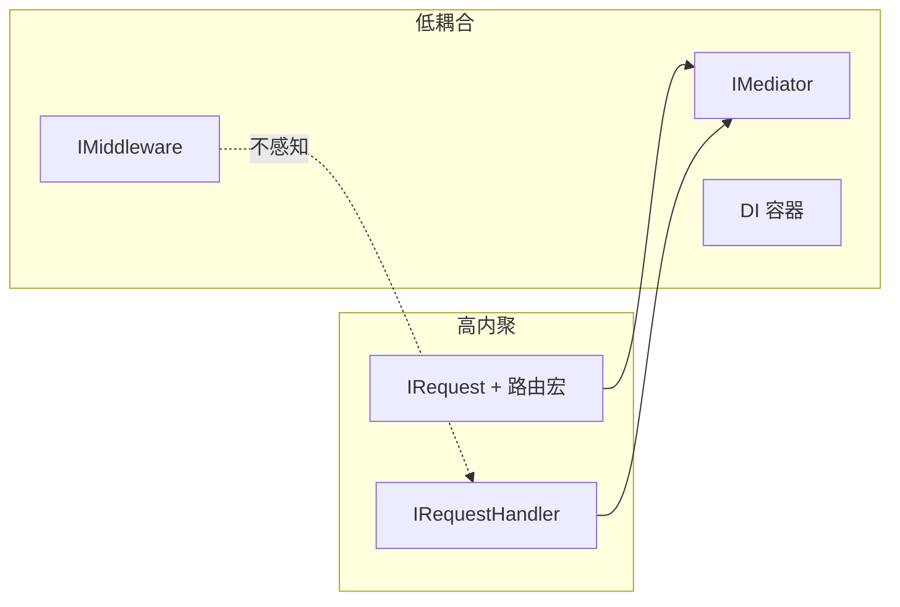

# 核心设计原则

## 约定优于配置（Convention over Configuration）

框架通过强约定减少决策疲劳：

| 约定 | 效果 |
|------|------|
| Request 即路由声明 | 无需维护独立路由表 |
| Handler 命名 `XxxHandler` | 一眼识别职责 |
| `contracts/` + `handlers/` 分层 | 团队结构统一 |
| `Error` 变体映射状态码 | 无需每处手写 HTTP 码 |

当你遵循约定时，`Host::build()` 零配置即可运行。偏离约定时（如 Handler 有复杂依赖），框架提供手动注册 escape hatch，而非强制你留在约定内。

## 高内聚、低耦合



- **core Crate 零实现依赖**：trait 定义与实现完全分离
- **Handler 之间不直接调用**：通过 `IMediator::send()` 或事件 `publish()`
- **中间件不感知业务**：只操作 `IHttpContext`

## 单一职责（SRP）

每个类型只做一件事：

| 类型 | 唯一职责 |
|------|---------|
| `HelloRequest` | 声明「这是一个 Hello 请求」+ 路由元数据 |
| `HelloHandler` | 执行 Hello 业务逻辑 |
| `LoggingMiddleware` | 记录请求日志 |
| `JwtAuth` | 验证 Bearer Token |

违反 SRP 的信号：一个 Handler 超过 100 行、处理了两种不相关的请求、直接操作 HTTP 响应头。

## 开闭原则（OCP）

扩展开放，修改关闭：

- **新端点**：添加 Request + Handler 文件，不修改 `main.rs` 路由表
- **新中间件**：`impl IMiddleware` + 注册，不修改管道源码
- **新授权策略**：实现 `IAuthorizationPolicy` 或扩展 `ResourceAuthorization`

## 依赖倒置（DIP）

业务代码依赖抽象：

```rust
// ✅ Handler 依赖 trait
struct GetUserHandler {
    cache: Arc<dyn IDistributedCache>,
}

// ❌ Handler 直接依赖具体实现
struct GetUserHandler {
    cache: Arc<MemoryCache>,
}
```

框架中所有横切能力均以 trait 暴露：`IMiddleware`、`IDistributedCache`、`IAuthenticationHandler`。

## 请求即边界（Request as Boundary）

每个 `IRequest<T>` 是一个**模块边界**：

- 输入：struct 字段（路径参数、Body、Query）
- 输出：`T` 泛型参数（响应 DTO 类型）
- 元数据：路由、HTTP 方法、授权要求

这使 AI 辅助开发、代码生成、OpenAPI 文档化天然可行——边界信息全部编码在类型中。

## 失败即数据（Errors as Values）

Rust 的 `Result<T, Error>` 贯穿全栈：

```rust
async fn handle(&self, req: GetUserRequest) -> Result<UserDto> {
    self.repo.find(&req.id)
        .ok_or_else(|| Error::NotFound(format!("User {}", req.id)))
}
```

不使用 panic 处理业务错误；框架异常中间件统一将 `Error` 转为 HTTP 响应。

## 小结

rust-webapp 的设计原则可浓缩为：**用类型承载契约，用约定减少配置，用 trait 隔离变化**。下一节看这些原则如何从 ASP.NET Core 传承而来。

下一节：[ASP.NET Core 的启发](aspnet-inspiration.md)
