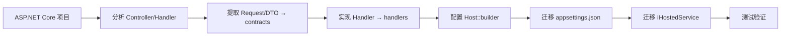

# 从 ASP.NET Core 迁移

## 迁移路线图



## 步骤 1：Controller → Request + Handler

### ASP.NET Core

```csharp
[ApiController]
[Route("api/[controller]")]
public class UsersController : ControllerBase
{
    [HttpGet("{id}")]
    public async Task<ActionResult<UserDto>> GetUser(string id)
    {
        var user = await _repo.FindAsync(id);
        if (user == null) return NotFound();
        return Ok(user);
    }
}
```

### rust-webapp

```rust
// contracts/user.rs
pub struct GetUserRequest { pub id: String }

#[get("/api/users/{id}")]
impl IRequest<UserDto> for GetUserRequest {}

// handlers/user.rs
#[handler(inject)]
#[async_trait]
impl IRequestHandler<GetUserRequest, UserDto> for GetUserHandler {
    async fn handle(&self, req: GetUserRequest) -> Result<UserDto> {
        self.repo.find(&req.id)
            .ok_or_else(|| Error::NotFound(format!("User {}", req.id)))
    }
}
```

## 步骤 2：Startup → HostBuilder

### ASP.NET Core

```csharp
var builder = WebApplication.CreateBuilder(args);
builder.Services.AddSingleton<IUserRepo, UserRepo>();
builder.Services.AddMediatR(cfg => cfg.RegisterServicesFromAssembly(...));
var app = builder.Build();
app.UseAuthentication();
app.UseAuthorization();
app.MapControllers();
app.Run();
```

### rust-webapp

```rust
Host::builder()
    .register(|svc| {
        svc.singleton::<UserRepo>(|_| Arc::new(UserRepo::new()));
    })
    .use_auth()
    .build()
    .run()
    .await?;
```

## 步骤 3：MediatR → IMediator

| MediatR | rust-webapp |
|---------|-------------|
| `IRequest<T>` | `IRequest<T>` |
| `IRequestHandler<T,R>` | `IRequestHandler<T,R>` |
| `IMediator.Send()` | `IMediator::send()` |
| `INotification` | `IEventRequest` + `publish()` |
| `IPipelineBehavior` | `IPipelineBehavior` |

## 步骤 4：配置迁移

`appsettings.json` 格式几乎直接复用，注意字段名大小写：

```json
{
  "App": {
    "Name": "My API",
    "Urls": ["http://0.0.0.0:5000"]
  }
}
```

## 步骤 5：IHostedService

API 完全相同：

```rust
#[async_trait]
impl IHostedService for DbInitService {
    async fn start(&self) -> Result<()> { ... }
    async fn stop(&self) -> Result<()> { ... }
}
```

## 迁移时间估算

| 项目规模 | 预估时间 |
|---------|---------|
| 小型（< 20 端点） | 1-2 天 |
| 中型（20-100 端点） | 1-2 周 |
| 大型（> 100 端点） | 2-4 周 |

主要时间花在 Rust 语法学习和领域模型重写，框架本身迁移成本很低。

## 小结

ASP.NET Core 开发者迁移到 rust-webapp 的核心是「概念映射」而非「重新学习」。

下一节：[从 Axum / Actix 迁移](from-axum-actix.md)
