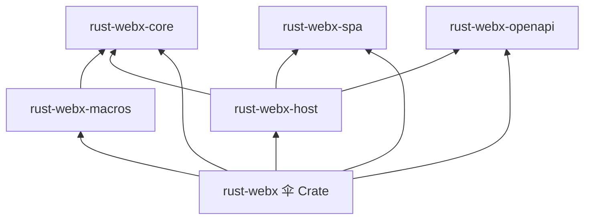

# 生态与 Crate 全景

## Workspace 总览

rust-webx 以 Cargo Workspace 组织，各 Crate 职责单一、依赖方向清晰：

```
rust-webx/                    # Workspace 根
├── crates/
│   ├── core/                   # rust-webx-core — 核心 trait（零实现依赖）
│   ├── host/                   # rust-webx-host — Host、管道、路由、认证实现
│   ├── macros/                 # rust-webx-macros — 过程宏
│   ├── spa/                    # rust-webx-spa — SPA 静态托管
│   ├── openapi/                # rust-webx-openapi — OpenAPI 生成
│   └── webapp/                 # rust-webx — 伞 Crate，统一导出
├── docbit/                     # 示例：作品集全栈应用
└── docs/rust-webx/           # 本书文档（仓库根目录）
```

## 依赖关系图



**关键原则**：`core` 只定义 trait，不依赖任何实现 Crate。这保证了：

- 自定义中间件只需依赖 `core`
- 测试可 Mock 所有抽象接口
- 未来可替换 HTTP 实现而不影响业务代码

## 各 Crate 职责

### rust-webx-core

定义框架的**语言**——所有公开 trait 与类型：

| 模块 | 核心类型 |
|------|---------|
| `mediator` | `IRequest<T>`, `IEventRequest`, `IMediator` |
| `handler` | `IRequestHandler<T,R>`, `IEventHandler<T>`, `IHostedService` |
| `http` | `IHttpContext`, `IHttpRequest`, `IHttpResponse`, `IClaimsExt` |
| `middleware` | `IMiddleware` |
| `routing` | `IRouter`, `IEndpoint`, `RouteMeta`, `HttpMethod` |
| `auth` | `IClaims`, `IAuthenticationHandler`, `IAuthorizationPolicy` |
| `error` | `Error`, `Result` |
| `config` | `AppOptions`, `appsettings` 加载 |
| `cache` | `IDistributedCache` |
| `problem` | `ProblemDetails`, `FieldError` |
| `pagination` | `PagedRequest`, `PagedResponse` |

### rust-webx-host

框架的**运行时**：

- `Host` / `HostBuilder` — 应用宿主与构建器
- `Router` — 基于 Trie 的路由匹配
- `MiddlewarePipeline` — 中间件顺序执行
- `HttpContext` — HTTP 上下文具体实现
- `JwtAuth` / `ResourceAuthorization` — 认证授权实现
- `MemoryCache`, `RateLimiter`, `CorsMiddleware` 等内置中间件

### rust-webx-macros

编译时魔法：

| 宏 | 作用 |
|----|------|
| `#[get("/path")]` 等 | 路由注册 + HTTP 方法 |
| `#[handler]` | Handler 自动 DI 注册 |
| `#[authorize]` | 声明式授权元数据 |
| `#[derive(WebxRequestMeta)]` + `#[from_query]` / `#[from_route]` / `#[from_body]` | OpenAPI 参数元数据（字段级属性，非独立宏） |

### rust-webx-spa

`SpaMiddleware`：托管静态文件，非 API 路径 fallback 到 `index.html`，支持前端 History 路由。

### rust-webx-openapi

从编译时收集的路由元数据生成 OpenAPI 3.0 规范，内置 Swagger UI HTML。

### rust-webx（伞 Crate）

应用开发者只需：

```toml
[dependencies]
rust-webx = "0.2"
```

```rust
use rust_webx::*;  // 一次导入全部公开 API
```

## 外部依赖

| 依赖 | 用途 |
|------|------|
| `rust-dix` | DI 容器（ServiceCollection / ServiceProvider） |
| `hyper` + `tokio` | HTTP 服务器与异步运行时 |
| `inventory` | 编译时路由与 Handler 元数据收集 |
| `serde` / `serde_json` | JSON 序列化 |
| `jsonwebtoken` | JWT 编解码 |
| `async-trait` | async trait 支持 |

## 应用开发者视角

作为框架使用者，你**通常只需依赖 `rust-webx` 伞 Crate**。仅在以下情况直接接触子 Crate：

- 编写独立中间件库 → 依赖 `rust-webx-core`
- 贡献框架本身 → 修改对应子 Crate

## 示例项目 Docbit

`docbit` 是框架的**官方参考实现**，展示：

- 全栈单体（API + SPA + 文档系统）
- `IHostedService` 数据初始化
- JWT 认证与 `#[authorize]`
- `#[inject]` 依赖注入
- 多模块 handlers（auth、blog、docs、work 等）

运行：`cargo run -p docbit`

## 小结

rust-webx 的 Crate 分层体现了**接口与实现分离**的设计：core 定义契约，host 提供运行时，macros 提供编译时便利，伞 Crate 统一开发者体验。

下一章：[快速上手](../02-quickstart/INDEX.md)
