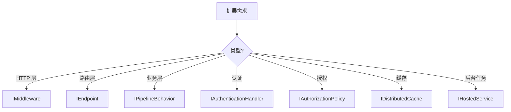

# 渐进式披露与框架边界

## 什么是渐进式披露

**渐进式披露**（Progressive Disclosure）原则：先展示解决 80% 场景的最简路径，高级能力按需揭示，避免一次性压倒用户。

rust-webx 的学习曲线设计：

```
Level 0: Hello World（4 行核心代码）
    ↓
Level 1: CRUD + 手动 DI 注册
    ↓
Level 2: 中间件 + 配置 + 认证
    ↓
Level 3: 事件系统 + PipelineBehavior + 自定义 Endpoint
    ↓
Level 4: 框架扩展 + 贡献 core trait 实现
```

每一级都能产出**可运行的生产代码**，而非「学完才能用」。

## 框架各层的披露顺序

### 第一层：零配置启动

```rust
Host::builder().build().run().await?;
```

`#[handler]` + `#[get]` 自动完成路由与 DI。适合原型和简单 API。

### 第二层：显式注册

```rust
Host::builder()
    .register(|svc| {
        register_handlers!(svc, ...);
        svc.singleton::<MyRepo>(|_| Arc::new(MyRepo::new()));
    })
    .build()
```

当 Handler 需要注入依赖时披露。

### 第三层：横切能力

```rust
Host::builder()
    .add_authentication()
    .use_cors(config)
    .use_memory_cache()
    .configure(|app| app.useOptions(|o| { ... }))
```

生产级能力通过 Builder 方法按需链接。

### 第四层：深度扩展

- 自定义 `IMiddleware`
- 自定义 `IEndpoint`
- 实现 `IPipelineBehavior`
- 实现 `IAuthorizationPolicy`

仅在默认能力不够时披露。

## 框架边界声明

明确「框架做什么」和「不做什么」，避免职责蔓延：

### 框架负责

| 职责 | 说明 |
|------|------|
| HTTP 管线 | 监听、路由、中间件、序列化 |
| DI 编排 | 服务注册与生命周期 |
| 编译时收集 | 路由、Handler、授权元数据 |
| 横切能力 | 认证、CORS、限流、缓存接口 |
| 应用生命周期 | 启动、优雅关闭、HostedService |

### 应用负责

| 职责 | 说明 |
|------|------|
| 业务逻辑 | Handler 内的领域规则 |
| 数据持久化 | 选择 ORM / SQL 驱动 |
| 领域模型 | Entity、Value Object、聚合 |
| 前端 UI | 任意框架，通过 SPA 托管或独立部署 |
| 基础设施选型 | 消息队列、搜索引擎等 |

### 刻意不内置

- ORM / 数据库迁移（提供 `IHostedService` 钩子自行集成）
- 消息队列（通过事件系统可对接）
- 前端组件库
- 部署编排（Docker/K8s 配置由用户管理）

## 扩展点一览

当你需要超出默认能力时，框架提供以下**稳定扩展点**：



详见 [第十三章 扩展与自定义封装](../13-extensibility/INDEX.md)。

## 对文档读者的建议

1. **先跑通 Hello World**，建立肌肉记忆
2. **遇到具体需求时再深入对应章节**，不要试图一次读完
3. **参考 Docbit 源码**作为「标准答案」
4. **遇到框架限制**，先查 [常见陷阱](../14-best-practices/common-pitfalls.md)，再考虑扩展点

## 小结

rust-webx 通过渐进式披露降低学习门槛，通过明确边界防止过度设计。简单场景简单做，复杂场景有路可走。

下一章：[架构全景](../04-architecture/INDEX.md)
