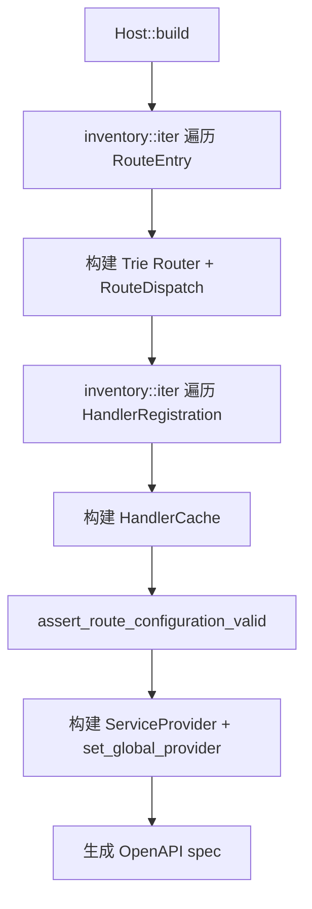

# 编译时扫描机制

## 为什么需要编译时扫描

传统 Rust Web 框架在运行时构建路由表。rust-webx 选择在**编译期**收集元数据，带来：

- 启动时零反射开销
- 遗漏注册在编译期暴露
- OpenAPI 文档可从同一元数据生成

## inventory 机制

框架使用 `inventory` crate 实现编译时收集：

```rust
// 宏展开后大致等价于：
inventory::submit! {
    RouteEntry {
        method: HttpMethod::Get,
        path: "/hello",
        request_type: TypeId::of::<HelloRequest>(),
        response_type: ...,
        ...
    }
}
```

每个 `#[get]`、`#[post]` 等宏在展开时向 `inventory` 提交一条 `RouteEntry`。

## Host::build() 扫描流程



## 路由收集

`#[get("/api/users/{id}")]` 宏展开时记录：

| 字段 | 值 |
|------|---|
| HTTP Method | GET |
| Path Pattern | `/api/users/{id}` |
| Request Type | `GetUserRequest` |
| Response Type | `UserDto` |
| Authorize | 可选的角色/权限要求 |

## Handler 收集

`#[handler]` / `#[handler(inject)]` 宏展开时向 inventory 提交 `HandlerRegistration`：

| 字段 | 值 |
|------|---|
| Request Type | `HelloRequest` |
| Response Type | `String` |
| Handler Type | `HelloHandler` |
| Factory | 构造 Handler（`Default` 或 DI 注入） |

HTTP 分发通过 `HandlerCache` 查找上述注册项，**不**通过 DI 查找 `dyn IRequestHandler`。

## #[handler(inject)] 与 #[inject]

当 Handler 需要 DI 注入时：

```rust
#[inject]
pub struct LoginHandler {
    ctx: Arc<Mutex<DbContext>>,
}

#[handler(inject)]
#[async_trait]
impl IRequestHandler<LoginRequest, AuthResponse> for LoginHandler { ... }
```

`#[inject]` 向 DI 容器注册构造逻辑；`#[handler(inject)]` 标记该 Handler 走注入路径而非 Default。

## 授权元数据收集

`#[authorize(role = "admin")]` 在编译期收集授权要求；`collect_authorizers()` 在 `build()` 时可构建 `ResourceAuthorization` 策略对象。

> **注意：** `add_authentication()` 仅注册 JWT 中间件，**不会**自动挂载 `resource_auth_middleware`。路由级授权在 `StubEndpoint` 内执行；全局 Resource Auth 中间件需手动添加。详见 [资源授权](../09-auth-security/resource-authorization.md)。

## 注意事项

1. **链接时收集**：`inventory` 依赖链接时合并，确保 Handler 所在 crate 被链接（未被 dead_code 优化掉）
2. **跨 crate**：子 crate 的路由需在该 crate 中被引用（`mod handlers;`）才会参与链接
3. **测试 binary**：集成测试需 `use` 相关模块以触发 inventory 收集

## 小结

编译时扫描是 rust-webx「零配置」体验的技术基石。你写 `#[get]` + `#[handler]`，框架在 `build()` 时自动完成路由表、HandlerCache 关联与文档生成；配置不一致时启动即 panic。

下一章：[请求即端点](../05-request-pattern/INDEX.md)
