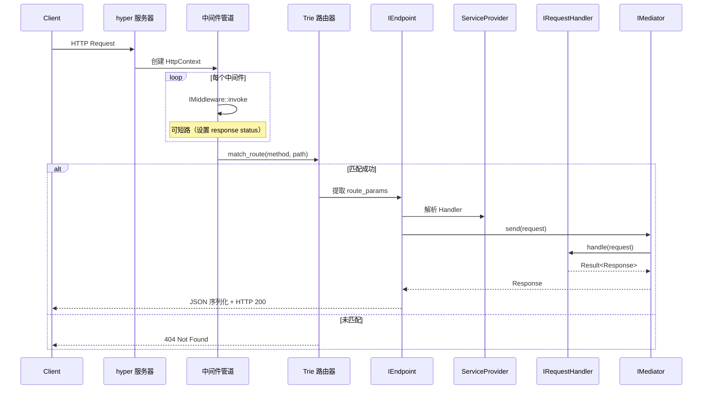
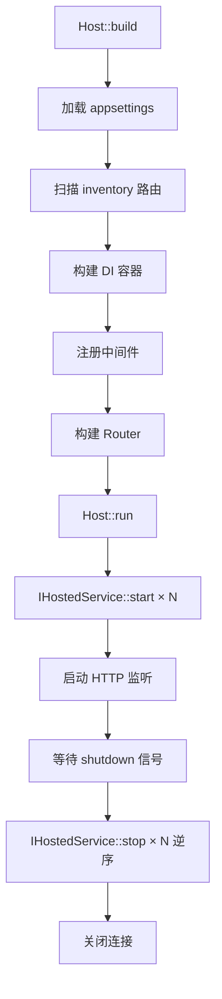

# 请求生命周期

## 全景流程图



## 阶段详解

### 1. 连接与请求读取

`Host::run()` 启动 hyper 监听器。每个连接由 Tokio 异步处理。`HttpContext::new()` 读取请求 body bytes（有大小限制，默认 10MB，可通过 `App.MaxBodySize` 配置）。

### 2. 中间件管道

中间件按**注册顺序**依次调用。每个中间件可：

- 读取/修改请求头
- 设置认证 claims（JWT 中间件）
- 检查 CORS 预检
- 限流拒绝
- **短路**：设置 response status 后返回，跳过后续处理

### 3. 路由匹配

`Router` 使用 Trie 树匹配 HTTP method + path：

- 静态段精确匹配
- `{param}` 动态段提取到 `route_params`
- 匹配成功后设置 `route_pattern()`（如 `/api/users/{id}`），供授权使用

### 4. 端点处理

`#[get]` / `#[post]` 等宏生成的 `RouteDispatch` 负责：

1. 从 `route_params`、query、body 构建 Request struct
2. 注入 claims，进入 `RequestContext`
3. 调用 `Mediator::send(request)`（与进程内调用同一路径）
4. 将响应序列化为 JSON 写入 `HttpResponse`

### 5. 错误处理

若 Handler 返回 `Err(Error::...)` 或管道中抛出错误，内置异常中间件捕获并映射：

```json
{"error": "User abc not found", "status": 404}
```

### 6. 响应发送

`HttpResponse` 转为 `hyper::Response`，通过已建立的连接返回客户端。

## 与 Mediator 的关系

对于 `#[endpoint]` / `#[get]` 等宏注册的路由，HTTP 适配层在构造 request 后调用：

```
RouteDispatch → Mediator::send(request) → dispatch → HandlerCache → IRequestHandler::handle
```

`IPipelineBehavior` 在 `dispatch` 内部包装 Handler 调用，实现验证、缓存等横切逻辑。

## 启动与关闭生命周期



## 小结

一次 HTTP 请求经历：中间件管道 → 路由匹配 → 端点调度 → Handler 执行 → 序列化响应。理解这条链路是调试和扩展的基础。

下一节：[分层模型与依赖方向](layering-model.md)
