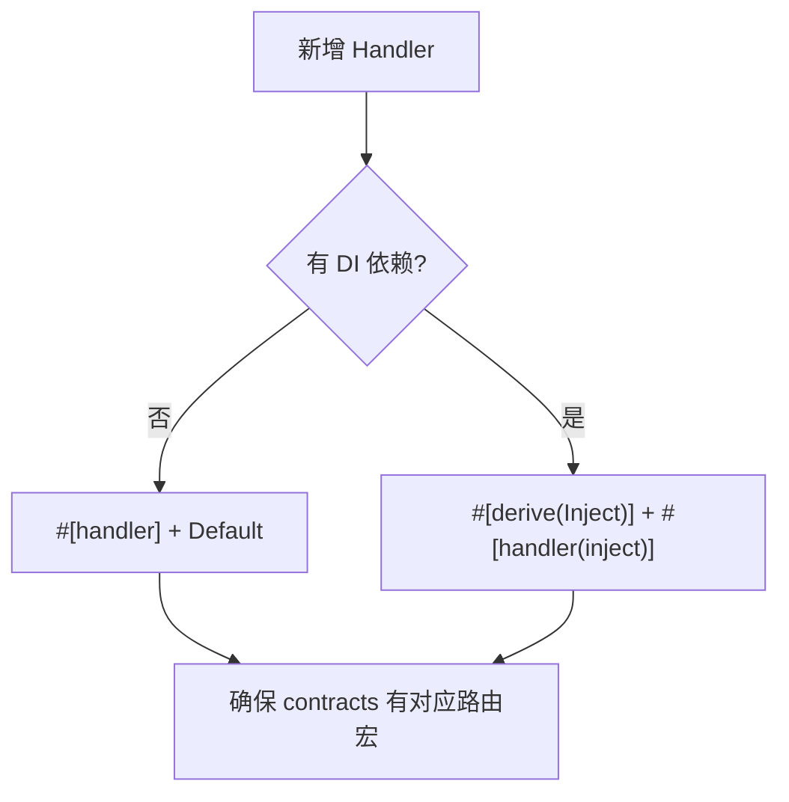

# Handler 注册策略

## 推荐方式：inventory + HandlerCache（HTTP 唯一路径）

HTTP 请求分发使用 **编译时 inventory 收集**，不通过 DI 查找 `dyn IRequestHandler`：

| 宏 | 收集内容 |
|----|---------|
| `#[get]` / `#[post]` 等 | `RouteEntry` — 路由表项 |
| `#[handler]` / `#[handler(inject)]` | `HandlerRegistration` — Handler 工厂 |
| endpoint 宏生成 | `RouteDispatch` — HTTP → Handler 桥接 |

`HostBuilder::build()` 将三者关联；配置不一致时 **启动 panic**（orphan route/handler）。

## 三种 Handler 声明方式

| 方式 | 适用场景 | 依赖注入 |
|------|---------|---------|
| `#[handler]` | Handler 实现 `Default` | 无依赖 |
| `#[handler(inject)]` + `#[derive(Inject)]` | Handler 有 DI 依赖 | rust-dix 自动注入 |
| 手动 `singleton` 注册 | 非 HTTP Mediator 场景 | 手动控制 |

## 方式一：#[handler] 零配置

```rust
#[derive(Default)]
struct HelloHandler;

#[handler]
#[async_trait]
impl IRequestHandler<HelloRequest, String> for HelloHandler { ... }
```

要求：
- Handler struct 实现 `Default`
- 无构造函数参数

## 方式二：#[derive(Inject)] + #[handler(inject)]（推荐）

`#[derive(Inject)]` 生成 rust-dix 构造器，`#[handler(inject)]` 让 inventory 工厂在每请求作用域内调用该构造器解析字段依赖。完整说明见 [依赖注入模式](../06-di-lifecycle/injection-patterns.md)。

```rust
#[derive(Inject)]
struct DocHandler {
    #[inject]
    docs: Arc<dyn IDocumentService>,
}

#[handler(inject)]
#[async_trait]
impl IRequestHandler<GetBlogRequest, BlogModel> for BlogHandler { ... }
```

## 诊断

```bash
cargo run -p my-host -- --doctor
```

输出路由表、orphan 路由/Handler。build 阶段也会 fail-fast。

## 决策流程



简单 Handler 用 `#[handler]`；生产项目推荐 `#[derive(Inject)]` + `#[handler(inject)]`，保持 `main.rs` 简洁。

下一节：[参数绑定与序列化](parameter-binding.md)
