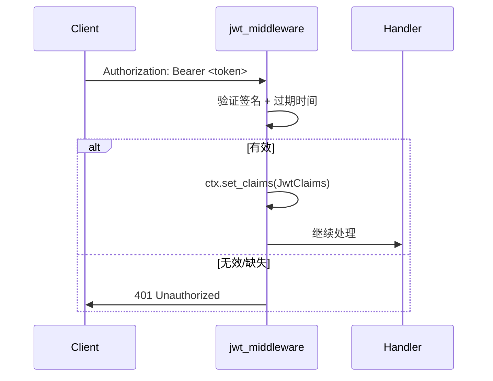

# JWT Bearer 认证

## 一行启用

```rust
Host::builder().add_authentication().build().run().await?;
```

自动：
1. 从 `appsettings.json` 读取 `Jwt.Secret`
2. 注册 `jwt_middleware`

资源级授权不由 `add_authentication()` 注册；需要时显式调用 `.use_resource_authorization()`（见[基于资源的授权](resource-authorization.md)）。

## 配置

```json
{
  "Jwt": {
    "Secret": "your-256-bit-secret-change-in-production"
  }
}
```

## 认证流程



## 在 Handler 中访问 Claims

```rust
// JwtClaims 实现 IClaims
let claims = ctx.claims().unwrap();
println!("User: {}", claims.subject());
println!("Roles: {:?}", claims.roles());
```

## 签发 Token

框架提供 `jwt_secret()` 获取当前签名密钥；shim 的初始化与使用约定见[安全最佳实践](security-best-practices.md#jwt_secret-进程级-shim)：

```rust
use jsonwebtoken::{encode, EncodingKey, Header};

let token = encode(
    &Header::default(),
    &claims,
    &EncodingKey::from_secret(jwt_secret().as_bytes()),
)?;
```

Docbit 的 `LoginHandler` 是完整示例。

## 小结

`add_authentication()` + `Jwt.Secret` 配置即可启用 JWT 认证，Claims 通过 `IHttpContext` 存取。

下一节：[基于资源的授权](resource-authorization.md)
